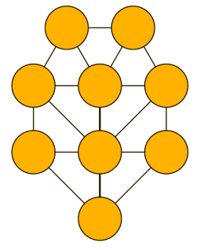
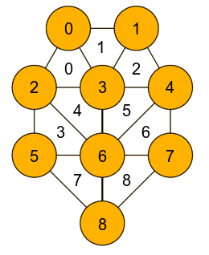

**But du jeu** : Il faut que la somme des chiffres présents aux sommets de chaque triangle (de 1 à 9 inclus, uniques) soit égale au nombre présent à l'intérieur du triangle. Un jeu à compléter ne donnera initialement que les nombres présents dans les triangles et laissera les sommets à déterminer.

**_Hyp._** : Il y a 9 triangles contenant la somme des chiffres présents à leurs sommets. 
    L'association des triangles forme un polygône à 7 côtés, il y a 9 chiffres distincts.

**_Rq._** : Un triangle ne pourra pas contenir un nombre plus grand que 9+8+7=24.

*Voici le jeu, vide :*

<div style="display: flex; justify-content: center;"></img></div>

<hr style="margin: 20px 0">

**Exercice** :
1) Déterminer les répartitions de triangles telles qu'il y ait une solution.
2) On donne une répartition et on dit qu'une valeur est erronée, il faut trouver laquelle.

<hr style="margin: 20px 0">

**Préliminaire** : Comment représenter ce jeu sous forme de données ? 
 
On souhaite représenter ce jeu de sorte qu'on puisse accéder facilement aux
données de sommets et de triangles adjacents, afin de pouvoir travailler de proche en proche.

On propose d'utiliser un dictionnaire comportant les indices de chaque triangle (lu de gauche à droite, de haut en bas), associé aux trois indices de ses sommets (lus de gauche à droite, de haut en bas).

*Graphiquement* : 

<div style="display: flex; justify-content: center;"></img></div>

*Pythoniquement* :

```python
>>> # Initialisation :
>>> G = {
    0: (0, 2, 3),
    1: (0, 1, 3),
    2: (1, 3, 4),
    3: (2, 5, 6),
    4: (2, 3, 6),
    5: (3, 4, 6),
    6: (4, 6, 7),
    7: (5, 6, 8),
    8: (6, 7, 8)
}
```


<hr style="margin: 20px 0">

On représente l'ensemble des sommets des triangles comme une liste à 9 éléments dont les indices correspondent à ceux de la figure ci-dessus.

### 1) Répartitions des triangles.

**Approche** : combinaisons.

On génère toutes les combinaisons possibles de chiffres aux sommets des triangles, permettant de récupérer directement toutes les grilles possibles en sommant chaque triplet voulu grâce au dictionnaire initialisé précédemment.

Il y a alors `9! = 362880` combinaisons à générer, on sait donc que le nombre de jeux possibles sera de `362880` (on utilise alors numpy dans un objectif d'efficacité).

*Implémentation* : `repartitions` dans `impl.py`

*Remarques intéressantes* : La somme des valeurs des triangles ne pourra jamais être supérieure à 163 et jamais inférieure à 107.

### 2) Répartition erronée.

**Approche** :

En plus du dictionnaire précédent, on intialise un nouveau dictionnaire listant les liens entre sommets séparés par une "ligne de symétrie" (par exemple, les sommets d'indice (3 et 7) sont liés de cette manière, (0 et 6) et (0 et 4) aussi).

```python
>>> # Initialisation
>>> links = {
    0: (4, 6),
    1: (2, 6),
    2: (1, 4, 8),
    3: (5, 7),
    4: (0, 2, 8),
    5: (3, 7),
    6: (0, 1),
    7: (3, 5),
    8: (2, 4)
}
```

Le but ici est de calculer la somme des sommets non connus, à chaque fois à partir d'un nombre de départ (qu'on prendra systématiquement égal à 9, car c'est le plus facile à placer). Si pour toutes les positions, 9 ne peut pas être chiffre de départ, alors la grille est invalide. On essaiera de stocker la valeur problématique à chaque fois. 

Intuition : récursivité ? Pour plus tard...